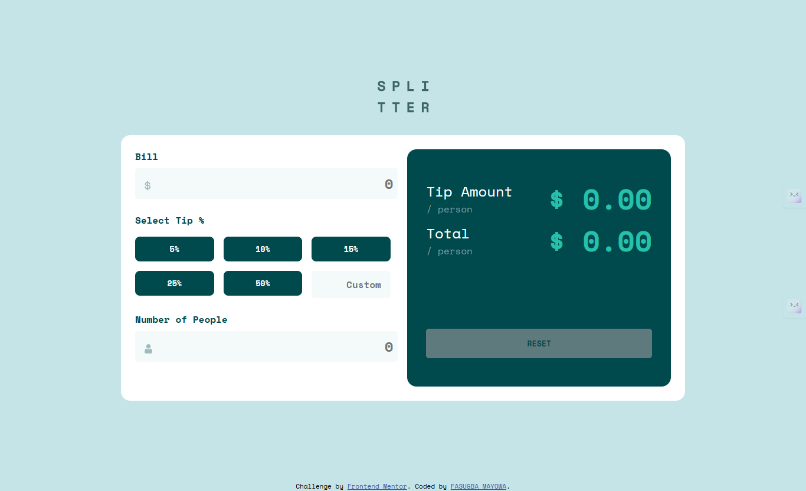

# Frontend Mentor - Tip calculator app solution

This is a solution to the [Tip calculator app challenge on Frontend Mentor](https://www.frontendmentor.io/challenges/tip-calculator-app-ugJNGbJUX). Frontend Mentor challenges help you improve your coding skills by building realistic projects.

## Table of contents

- [Overview](#overview)
  - [The challenge](#the-challenge)
  - [Screenshot](#screenshot)
  - [Links](#links)
- [My process](#my-process)
  - [Built with](#built-with)
  - [What I learned](#what-i-learned)
  - [Continued development](#continued-development)
- [Author](#author)

## Overview

### The challenge

Users should be able to:

- View the optimal layout for the app depending on their device's screen size
- See hover states for all interactive elements on the page
- Calculate the correct tip and total cost of the bill per person

### Screenshot



### Links

- Solution URL: [Add solution URL here](https://your-solution-url.com)
- Live Site URL: [Add live site URL here](https://your-live-site-url.com)

## My process

### Built with

- Semantic HTML5 markup
- CSS custom properties
- Flexbox
- Mobile-first workflow

### What I learned

One majot issue I ran into was clearing the values of the numbers in the textboxes, but I was able to work throught it by resetting each of them to default values.
```js
document.querySelector(".reset").addEventListener("click", () =>{
    total_bill.value = '';
    total_people.value = '';
    tip.textContent = '0.00';
    amount.textContent = '0.00';
})
```

### Continued development

I'm going to keep my focus on frontend, I want to be building scalable and functional sites from scratch. I would start by solidifying my Javascript and then diving into frameworks.

## Author

- Frontend Mentor - [@Fash-Mayor](www.frontendmentor.io/profile/Fash-Mayor)
- Twitter - [@_FashMayor_](https://www.twitter.com/_FashMayor)
